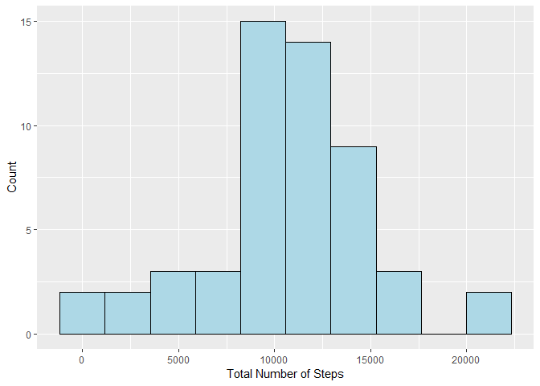
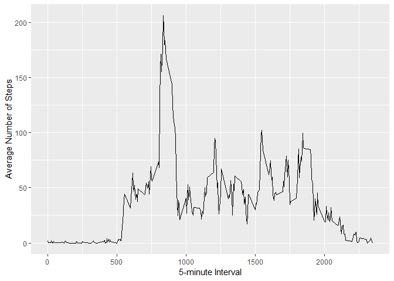
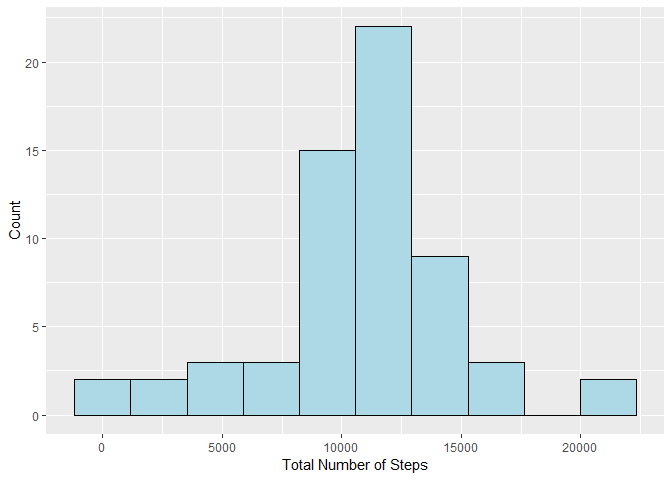
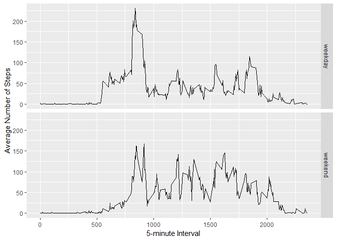

```r
# load package
library(plyr)
library(ggplot2)


# set dictionary
setwd("D:/Courses/Coursera/Data_Science_JHU/RepData_PeerAssessment1")

# transform system time to english (my original system language is not english)
Sys.setlocale("LC_TIME", "English")
```

```
## [1] "English_United States.1252"
```

## Loading and preprocessing the data


```r
activity <- read.csv("activity.csv")
activity$date <- as.Date(activity$date, "%Y-%m-%d")
```

## What is mean total number of steps taken per day?

For this part of the assignment, we ignore the missing values in the dataset.

**1. Make a histogram of the total number of steps taken each day**


```r
# get a data set of total steps without NA
step.perday <- ddply(na.omit(activity), .(date), summarize, steps = sum(steps))

# plot
ggplot(step.perday, aes(x=steps)) +
    geom_histogram(position="identity", aes(y=..count..), fill="lightblue",
                   colour="black", bins=10) +
    labs(y="Count", x="Total Number of Steps")
```

<!-- -->

**2. Calculate and report the mean and median total number of steps taken per day**


```r
# mean
(mean.steps <- mean(step.perday$steps))
```

```
## [1] 10766.19
```

```r
# median
(median.steps <- median(step.perday$steps))
```

```
## [1] 10765
```

As we can see, the mean total number of steps taken per day is 1.0766189\times 10^{4}, and the median is 1.0765\times 10^{4}.

## What is the average daily activity pattern?

**1. Make a time series plot (i.e. type="l") of the 5-minute interval (x-axis) and the average number of steps taken, averaged across all days (y-axis)**


```r
# get a data set of average steps without NA
step.int <- ddply(na.omit(activity), .(interval), summarize, steps = mean(steps))

ggplot(step.int, aes(x=interval, y=steps)) + geom_line() +
    labs(y="Average Number of Steps", x="5-minute Interval")
```

<!-- -->

**2. Which 5-minute interval, on average across all the days in the dataset, contains the maximum number of steps?**


```r
(maxstep.int <- step.int$interval[which.max(step.int$steps)])
```

```
## [1] 835
```

As we can see, the maximum number of steps on average across all the days is in the 104th interval, which is 835 minute.

## Imputing missing values

Note that there are a number of days/intervals where there are missing values (coded as NA). The presence of missing days may introduce bias into some calculations or summaries of the data.

**1. Calculate and report the total number of missing values in the dataset (i.e. the total number of rows with NAs)**


```r
(total.na <- sum(is.na(activity$steps)))
```

```
## [1] 2304
```

There are 2304 missing values in the dataset.

**2. Devise a strategy for filling in all of the missing values in the dataset. The strategy does not need to be sophisticated. For example, you could use the mean/median for that day, or the mean for that 5-minute interval, etc.**

**3. Create a new dataset that is equal to the original dataset but with the missing data filled in.**

I decided to use the mean for the 5-minute interval to fill in the missing values in the dataset.


```r
new.act <- activity
for (i in 1:nrow(step.int)) {
    new.act$steps[is.na(new.act$steps) & new.act$interval == step.int$interval[i]] <- step.int$steps[i]
}
```

**4. Make a histogram of the total number of steps taken each day and Calculate and report the mean and median total number of steps taken per day. Do these values differ from the estimates from the first part of the assignment? What is the impact of imputing missing data on the estimates of the total daily number of steps?**


```r
# get a data set of total steps
step.perday <- ddply(new.act, .(date), summarize, steps = sum(steps))

# plot
ggplot(step.perday, aes(x=steps)) +
    geom_histogram(position="identity", aes(y=..count..), fill="lightblue",
                   colour="black", bins=10) +
    labs(y="Count", x="Total Number of Steps")
```

<!-- -->

```r
# mean
(mean.steps <- mean(step.perday$steps))
```

```
## [1] 10766.19
```

```r
# median
(median.steps <- median(step.perday$steps))
```

```
## [1] 10766.19
```

As we can see, the mean total number of steps taken per day is 1.0766189\times 10^{4}, and the median is 1.0766189\times 10^{4}. These values do differ from the estimates from the first part of the assignment. Because of the inputing missing data, the most frequent total number of steps increased. 

## Are there differences in activity patterns between weekdays and weekends?

Use the dataset with the filled-in missing values for this part.

**1. Create a new factor variable in the dataset with two levels ¨C ¡°weekday¡± and ¡°weekend¡± indicating whether a given date is a weekday or weekend day.**


```r
week.flag <- weekdays(new.act$date)
new.act$week <- factor(ifelse(week.flag == "Saturday" | week.flag == "Sunday", "weekend", "weekday"))
```

**2.Make a panel plot containing a time series plot (i.e. type="l") of the 5-minute interval (x-axis) and the average number of steps taken, averaged across all weekday days or weekend days (y-axis). See the README file in the GitHub repository to see an example of what this plot should look like using simulated data.**


```r
# get a data set of average steps
step.int1 <- ddply(new.act[new.act$week=="weekday", ], .(interval), summarize, steps = mean(steps))
step.int1$week <- "weekday"
step.int2 <- ddply(new.act[new.act$week=="weekend", ], .(interval), summarize, steps = mean(steps))
step.int2$week <- "weekend"
step.int <- rbind(step.int1, step.int2)

# plot
ggplot(step.int, aes(x=interval, y=steps)) + geom_line() + facet_grid(week ~ .) + 
    labs(y="Average Number of Steps", x="5-minute Interval")
```

<!-- -->

