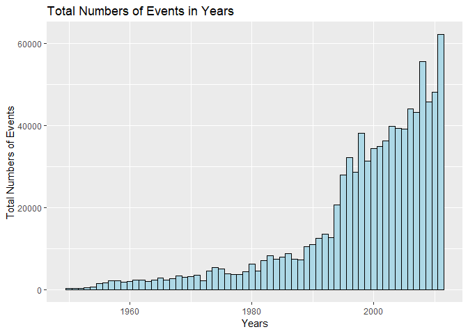
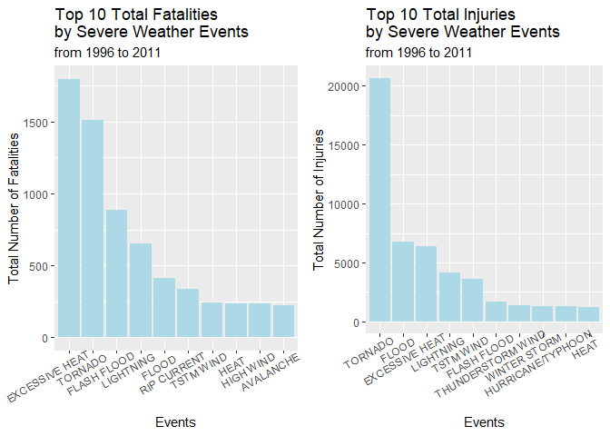
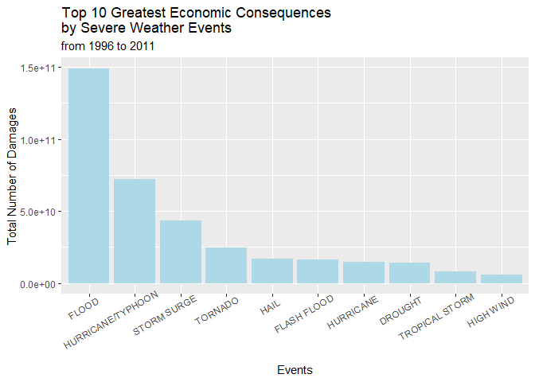

## Synopsis

Storms and other severe weather events can cause both public health and economic problems for communities and municipalities. Many severe events can result in fatalities, injuries, and property damage, and preventing such outcomes to the extent possible is a key concern.

This project involves exploring the U.S. National Oceanic and Atmospheric Administration's (NOAA) storm database. This database tracks characteristics of major storms and weather events in the United States, including when and where they occur, as well as estimates of any fatalities, injuries, and property damage.

The basic goal of this assignment is to explore the NOAA Storm Database and answer some basic questions about severe weather events. The following questions will be addressed:

1. Across the United States, which types of events (as indicated in the EVTYPE variable) are most harmful with respect to population health?

2. Across the United States, which types of events have the greatest economic consequences?

## Preparation


```r
# load package
library(R.utils) # unzip
library(ggplot2)
library(data.table) # fread
library(plyr) # ddply
library(gridExtra) # grid.arrange

# set dictionary
setwd("D:/Courses/Coursera/Data_Science_JHU/DataScienceSpecialization/05_Reproducible_Research/Project2")

# transform system time to english (my original system language is not english)
Sys.setlocale("LC_TIME", "English")
```

```
## [1] "English_United States.1252"
```

## Data Processing

We first read in the data from the comma-separated-value file.


```r
# download and unzip data
if (!file.exists("repdata_data_StormData.csv.bz2")) {
    download.file("http://d396qusza40orc.cloudfront.net/repdata%2Fdata%2FStormData.csv.bz2", destfile = "repdata_data_StormData.csv.bz2")
    bunzip2("repdata_data_StormData.csv.bz2", overwrite=T, remove=F)
}

# read data
storm <- fread("repdata_data_StormData.csv")
```

Check the numbers of row and column for the dataset.


```r
dim(storm)
```

```
## [1] 902297     37
```

There are 902297 rows and 37 columns in total.

Then draw a histogram to show total number of events in years.


```r
storm$BGN_DATE <- as.Date(storm$BGN_DATE, format = "%m/%d/%Y")

ggplot(storm, aes(x=year(BGN_DATE))) +
    geom_histogram(position="identity", aes(y=..count..), fill="lightblue",
                   colour="black", bins=length(unique(year(storm$BGN_DATE)))) +
    labs(y="Total Numbers of Events", x="Years", title="Total Numbers of Events in Years")
```

<!-- -->

The recorded events start in the year 1950 and end in November 2011. In the earlier years there are generally fewer events recorded, most likely due to a lack of good records. More recent years should be considered more complete.

According to NOAA the data recording start from Jan. 1950. At that time they recorded one event type, tornado. They add more events gradually and only from **Jan. 1996** they start recording all events type. Since our objective is comparing the effects of different weather events, we just analyze the data from **Jan. 1996**.


```r
sub.storm <- storm[year(storm$BGN_DATE) >= 1996, ]
dim(sub.storm)
```

```
## [1] 653530     37
```

Now we just have 653530 rows and 37 columns in total.

The 'CROPDMGEXP' is the exponent values for 'CROPDMG' (crop damage). In the same way, 'PROPDMGEXP' is the exponent values for 'PROPDMG' (property damage). We should use both to get the total values for crops and property damage. (B or b = Billion, M or m = Million, K or k = Thousand, H or h = Hundred).


```r
# crop damage
sub.storm$cropindex <- 0
sub.storm$cropindex[toupper(sub.storm$CROPDMGEXP) == "B"] <- 9
sub.storm$cropindex[toupper(sub.storm$CROPDMGEXP) == "M"] <- 6
sub.storm$cropindex[toupper(sub.storm$CROPDMGEXP) == "K"] <- 3
sub.storm$cropindex[toupper(sub.storm$CROPDMGEXP) == "H"] <- 2
sub.storm$crop <- sub.storm$CROPDMG * 10^sub.storm$cropindex

# property damage
sub.storm$propindex <- 0
sub.storm$propindex[toupper(sub.storm$PROPDMGEXP) == "B"] <- 9
sub.storm$propindex[toupper(sub.storm$PROPDMGEXP) == "M"] <- 6
sub.storm$propindex[toupper(sub.storm$PROPDMGEXP) == "K"] <- 3
sub.storm$propindex[toupper(sub.storm$PROPDMGEXP) == "H"] <- 2
sub.storm$prop <- sub.storm$PROPDMG * 10^sub.storm$propindex
```

In addition, we consider the economic consequences are consist of crop damage and property damage.


```r
sub.storm$economics <- sub.storm$crop + sub.storm$prop
```

## Results

### 1. Across the United States, which types of events (as indicated in the EVTYPE variable) are most harmful with respect to population health ?

First of all, we calculate the total numbers of fatalities for each type of events.


```r
fatal <- ddply(sub.storm, .(EVTYPE), summarize, fatalities = sum(FATALITIES))
fatal <- fatal[order(fatal$fatalities, decreasing = TRUE), ]
fatal[1:10, ]
```

```
##             EVTYPE fatalities
## 81  EXCESSIVE HEAT       1797
## 426        TORNADO       1511
## 98     FLASH FLOOD        887
## 224      LIGHTNING        651
## 102          FLOOD        414
## 300    RIP CURRENT        340
## 434      TSTM WIND        241
## 147           HEAT        237
## 177      HIGH WIND        235
## 16       AVALANCHE        223
```

We can find excessive heat causes the largest amount of fatalities and tornado causes the second largest amount of fatalities.

Except fatalities, the total numbers of injuries are also important.


```r
injur <- ddply(sub.storm, .(EVTYPE), summarize, injuries = sum(INJURIES))
injur <- injur[order(injur$injuries, decreasing = TRUE), ]
injur[1:10, ]
```

```
##                EVTYPE injuries
## 426           TORNADO    20667
## 102             FLOOD     6758
## 81     EXCESSIVE HEAT     6391
## 224         LIGHTNING     4141
## 434         TSTM WIND     3629
## 98        FLASH FLOOD     1674
## 421 THUNDERSTORM WIND     1400
## 507      WINTER STORM     1292
## 185 HURRICANE/TYPHOON     1275
## 147              HEAT     1222
```

For injuries, tornado causes the most events.

The following is a pair of plots of total fatalities and total injuries affected by these severe weather events.


```r
fatal$EVTYPE <- factor(fatal$EVTYPE, levels = fatal$EVTYPE)
p1 <- ggplot(fatal[1:10, ], aes(x=EVTYPE, y=fatalities)) + 
    geom_bar(stat = "identity", fill = "lightblue") +
    labs(y="Total Number of Fatalities", x="Events",
         title="Top 10 Total Fatalities \nby Severe Weather Events",
         subtitle="from 1996 to 2011"
         ) +
    theme(axis.text.x = element_text(angle = 30, hjust = 0.8))

injur$EVTYPE <- factor(injur$EVTYPE, levels = injur$EVTYPE)
p2 <- ggplot(injur[1:10, ], aes(x=EVTYPE, y=injuries)) + 
    geom_bar(stat = "identity", fill = "lightblue") +
    labs(y="Total Number of Injuries", x="Events",
         title="Top 10 Total Injuries \nby Severe Weather Events",
         subtitle="from 1996 to 2011"
         ) +
    theme(axis.text.x = element_text(angle = 30, hjust = 0.8))

grid.arrange(p1, p2, ncol = 2)
```

<!-- -->

In conclusion, tornado is most harmful with respect to population health across the United States.

### 2. Across the United States, which types of events have the greatest economic consequences?


```r
econo <- ddply(sub.storm, .(EVTYPE), summarize, economics = sum(economics))
econo <- econo[order(econo$economics, decreasing = TRUE), ]
econo[1:10, ]
```

```
##                EVTYPE    economics
## 102             FLOOD 148919611950
## 185 HURRICANE/TYPHOON  71913712800
## 342       STORM SURGE  43193541000
## 426           TORNADO  24900370720
## 142              HAIL  17071172870
## 98        FLASH FLOOD  16557105610
## 183         HURRICANE  14554229010
## 63            DROUGHT  14413667000
## 430    TROPICAL STORM   8320186550
## 177         HIGH WIND   5881421660
```

```r
econo$EVTYPE <- factor(econo$EVTYPE, levels = econo$EVTYPE)
ggplot(econo[1:10, ], aes(x=EVTYPE, y=economics)) + 
    geom_bar(stat = "identity", fill = "lightblue") +
    labs(y="Total Number of Damages", x="Events",
         title="Top 10 Greatest Economic Consequences\nby Severe Weather Events",
         subtitle="from 1996 to 2011"
         ) +
    theme(axis.text.x = element_text(angle = 30, hjust = 0.8))
```

<!-- -->

As we can see, flood has the greatest economic consequences across the United States.
