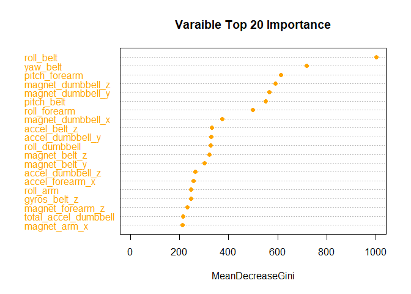

## Summary

One thing that people regularly do is quantify how *much* of a particular activity they do, but they rarely quantify how *well* they do it. The data in this project is from accelerometers on the belt, forearm, arm, and dumbell of 6 participants. They were asked to perform barbell lifts correctly and incorrectly in 5 different ways. The goal of this project is to predict the manner in which they did the exercise. 

The following issues will be described: How to build the model, how to use cross validation, what the expected out of sample error is, and why the choices were made. 20 different test cases will also be predicted by using the prediction model in this project.

## Preperation


```r
library(caret)
library(ggplot2)
library(randomForest)

# change system language
Sys.setlocale("LC_TIME", "English")
```

```
## [1] "English_United States.1252"
```

```r
# read data
training.raw <- read.csv("pml-training.csv", na.strings=c("NA", "#DIV/0!", ""))
testing<- read.csv("pml-testing.csv", na.strings=c("NA", "#DIV/0!", ""))
```

## Data Processing


```r
dim(training.raw)
```

```
## [1] 19622   160
```

As we can see, in the raw training dataset, there are 19622 observations and 160 variables. However, lots of variables are missing values or meaningless in this project. We need to remove them.


```r
# remove variables which NAs account for more than 80% values
na.sum <- apply(training.raw, 2, function(x) sum(is.na(x)))
training <- training.raw[, which(na.sum/nrow(training.raw) < 0.8)]

# remove variables which are meaningless in project
training <- training[, -c(1:7)]

dim(training)
```

```
## [1] 19622    53
```

Now the new training dataset has only 53 variables, including 1 outcome and 52 predictors.

## Cross Validation

The original training dataset needs to be split into a sub-training set (80%) and a sub-testing set (20%).


```r
set.seed(1111)
intrain <- createDataPartition(y=training$classe, p=0.8, list=FALSE)
subtrain <- training[intrain, ] 
subtest <- training[-intrain, ]

dim(subtrain)
```

```
## [1] 15699    53
```

```r
dim(subtest)
```

```
## [1] 3923   53
```

The sub-training set has 15699 observations and 53 variables. The sub-testing set has 3923 observations and 53 variables.

## Model Training

We choose to build decision trees due to its better performance in nonlinear settings and easily interpreted.


```r
set.seed(9102)
# fit models
modfit <- randomForest(classe ~ ., data=subtrain, type="class")
```

We can view the confusion matrix and class errors for the model in sub-training set:


```r
modfit$confusion
```

```
##      A    B    C    D    E class.error
## A 4459    4    0    0    1 0.001120072
## B   13 3022    3    0    0 0.005266623
## C    0   10 2726    2    0 0.004382761
## D    0    0   21 2550    2 0.008938982
## E    0    0    1    7 2878 0.002772003
```

The results seem very good!

## Variable Importance


```r
varImpPlot(modfit, sort=TRUE, n.var=min(20, nrow(modfit$importance)),
           main="Varaible Top 20 Importance", pch=16, color="orange")
```

<!-- -->

## Prediction

Use the random forest model to predict the sub-testing data, and then view the confusion matrix.


```r
prediction.sub <- predict(modfit, subtest)
(confu <- confusionMatrix(prediction.sub, subtest$classe))
```

```
## Confusion Matrix and Statistics
## 
##           Reference
## Prediction    A    B    C    D    E
##          A 1115    1    0    0    0
##          B    1  756    6    0    0
##          C    0    2  678   11    0
##          D    0    0    0  632    2
##          E    0    0    0    0  719
## 
## Overall Statistics
##                                           
##                Accuracy : 0.9941          
##                  95% CI : (0.9912, 0.9963)
##     No Information Rate : 0.2845          
##     P-Value [Acc > NIR] : < 2.2e-16       
##                                           
##                   Kappa : 0.9926          
##                                           
##  Mcnemar's Test P-Value : NA              
## 
## Statistics by Class:
## 
##                      Class: A Class: B Class: C Class: D Class: E
## Sensitivity            0.9991   0.9960   0.9912   0.9829   0.9972
## Specificity            0.9996   0.9978   0.9960   0.9994   1.0000
## Pos Pred Value         0.9991   0.9908   0.9812   0.9968   1.0000
## Neg Pred Value         0.9996   0.9991   0.9981   0.9967   0.9994
## Prevalence             0.2845   0.1935   0.1744   0.1639   0.1838
## Detection Rate         0.2842   0.1927   0.1728   0.1611   0.1833
## Detection Prevalence   0.2845   0.1945   0.1761   0.1616   0.1833
## Balanced Accuracy      0.9994   0.9969   0.9936   0.9911   0.9986
```

The accuracy is 0.9941, which is good enough. Moreover, the expected out of sample errors by class are very small.

## Prediction for the 20 different test cases

We have 20 different test cases need to be predicted.


```r
(prediction <- predict(modfit, testing))
```

```
##  1  2  3  4  5  6  7  8  9 10 11 12 13 14 15 16 17 18 19 20 
##  B  A  B  A  A  E  D  B  A  A  B  C  B  A  E  E  A  B  B  B 
## Levels: A B C D E
```
