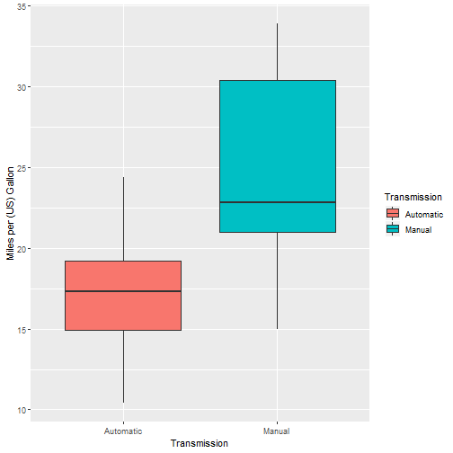

Presentation
========================================================
author: Dongyuan Wu
date: 2019-05-15
autosize: true

## Introduction for the App: Effect Factors of MPG

Background
========================================================

The data set used in this App is *mtcars* with 10 aspects of automobile design and performance for 32 automobiles.

The aim of this App is to make users more convinent to find the influence of any one of the ten factors on MPG.

If the chosen variable is continuance, a scatter plot will be shown. If the chosen variable is discrete, a boxplot will be shown.

Moreover, the App will build an univariate linear model for the chosen variable and MPG. The coefficients and the model's R-squared will be shown.

Example - Transmission
========================================================

If variable *Transmission* is chosen, the App will display a boxplot for transmission and MPG.


```r
var <- mtcars[, "am"]
xlab <- "Transmission"
ggplot(mtcars, aes(x=var, y=mpg, fill=var)) + geom_boxplot() +
    labs(y="Miles per (US) Gallon", x=xlab) +
    guides(fill=guide_legend(title=xlab))
```



Example - Transmission
========================================================

If variable *Transmission* is chosen, the App will build a univariate linear regression model that the predictor is *am* and the outcome is *mpg*. Then the coefficients and the R-squared of the model will be shown.


```r
formu <- formula(paste("mpg~", "am"))
model <- summary(lm(formu, data=mtcars))
tabl <- as.data.frame(model$coefficients)
tabl
```

```
             Estimate Std. Error   t value     Pr(>|t|)
(Intercept) 17.147368   1.124603 15.247492 1.133983e-15
amManual     7.244939   1.764422  4.106127 2.850207e-04
```

Example - Transmission
========================================================

If variable *Transmission* is chosen, the App will build a univariate linear regression model that the predictor is *am* and the outcome is *mpg*. Then the coefficients and the R-squared of the model will be shown.


```r
descr <- paste("The R-Squared for this univariate linear regression model is:",
               model$r.squared)
descr
```

```
[1] "The R-Squared for this univariate linear regression model is: 0.359798943425465"
```
