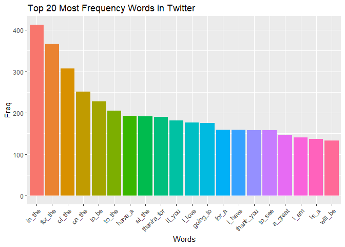

## Summary

This document will be concise and explain the major features of the data and briefly summarize the plans for creating the prediction algorithm and Shiny app in a way that would be understandable to a non-data scientist manager. 

The motivation for this project is to: 

1. Demonstrate that the data have been downloaded and successfully loaded in.

2. Create a basic report of summary statistics about the data sets.

3. Report any interesting findings.

4. Get feedback on the plans for creating a prediction algorithm and Shiny app.

## Preperation


```r
library(ggplot2)
library(stringi)
library(knitr)
library(tm)
library(wordcloud)
#library(RWeka) # N-grams doesn't work with tm
library(quanteda) # N-grams

# change system language
Sys.setlocale("LC_TIME", "English")
```

```
## [1] "English_United States.1252"
```

```r
# read data
setwd("D:/Courses/Coursera/Data_Science_JHU/10_Data_Science_Capstone/Milestone")
 
con <- file("en_US.news.txt", open="r")
news <- readLines(con, encoding = "UTF-8")
close(con)
    
con <- file("en_US.blogs.txt", open="r")
blogs <- readLines(con, encoding = "UTF-8")
close(con) 

con <- file("en_US.twitter.txt", open="r")
twitter <- readLines(con, encoding = "UTF-8")
close(con)
```

## Datasets Summary

First of all, the summaries of the three datasets were shown.


```r
stringsummary <- function(string) {
    size <- format(object.size(string), units = "Mb")
    lines <- stri_stats_general(string)[1]
    words <- stri_stats_general(string)[4]
    data.frame("Data Sizes"=size, "Line Counts"=lines, "Word Counts"=words)
}
summ <- rbind(stringsummary(blogs), stringsummary(news), stringsummary(twitter))
rownames(summ) <- c("Blogs", "News", "Twitter")
kable(summ, align="c")
```

           Data.Sizes    Line.Counts    Word.Counts 
--------  ------------  -------------  -------------
Blogs       255.4 Mb       899288        170389539  
News        19.8 Mb         77259        13072698   
Twitter      319 Mb        2360148       134082634  

## Data Preprocessing

For the reason that the datasets were very large and my laptop's RAM was too small to analyze the whole datasets, I just sampled 0.5% lines to analyze in each dataset.


```r
set.seed(1234)
blogs <- sample(blogs, length(blogs)*0.005)
news <- sample(news, length(news)*0.005)
twitter <- sample(twitter, length(twitter)*0.005)
```

The summaries for the sampled datasets were below:


```r
summ <- rbind(stringsummary(blogs), stringsummary(news), stringsummary(twitter))
rownames(summ) <- c("Blogs", "News", "Twitter")
kable(summ, align="c")
```

           Data.Sizes    Line.Counts    Word.Counts 
--------  ------------  -------------  -------------
Blogs        1.3 Mb         4496          872035    
News         0.1 Mb          386           69144    
Twitter      1.6 Mb         11800         671468    

Then create some functions to combine the produces for data processing.


```r
str.corp <- function(string) {
    corp <- Corpus(VectorSource(string))
    return(corp)
}

removeSpecialChars <- function(x) gsub("[^a-zA-Z0-9 ]", "", x)
str.clean <- function(corp) {
    corp <- tm_map(corp, content_transformer(tolower))
    corp <- tm_map(corp, removeNumbers)
    corp <- tm_map(corp, removeWords, stopwords("en"))
    corp <- tm_map(corp, removePunctuation)
    corp <- tm_map(corp, removeSpecialChars)
    corp <- tm_map(corp, stripWhitespace)
    return(corp)
}

blogs.corp <- str.clean(str.corp(blogs))
news.corp <- str.clean(str.corp(news))
twitter.corp <- str.clean(str.corp(twitter))

#rm(blogs, news, twitter)
```

## Unigram Words Analysis


```r
str.freq <- function(corp) {
    dtm <- DocumentTermMatrix(corp, control=list(encoding="UTF-8"))
    freq <- colSums(as.matrix(dtm))
    freq <- freq[order(freq, decreasing = T)]
    data.frame("words"=names(freq), "freq"=freq, "prop"=freq/sum(freq)*100, 
               "cumprop"=cumsum(freq)/sum(freq)*100)
}

blogs.freq <- str.freq(blogs.corp)
news.freq <- str.freq(news.corp)
twitter.freq <- str.freq(twitter.corp)
```

### Blogs


```r
ggplot(blogs.freq[1:20, ], 
       aes(x = reorder(words, -freq), y = freq, fill = reorder(words, -freq))) + 
    geom_bar(stat = "identity") + labs(y = "Freq", x = "Words",
                                       title = "Top 20 Most Frequency Words in Blogs") + 
    guides(fill = F) + theme(axis.text.x = element_text(angle = 45, hjust = 1))
```

<!-- -->


```r
set.seed(1234)
wordcloud(words = blogs.freq$words[1:80], freq = blogs.freq$freq[1:80],
          random.order=FALSE, rot.per=0.35, colors=brewer.pal(8, "Dark2"))
```

<!-- -->

### News


```r
ggplot(news.freq[1:20, ], 
       aes(x = reorder(words, -freq), y = freq, fill = reorder(words, -freq))) + 
    geom_bar(stat = "identity") + labs(y = "Freq", x = "Words",
                                       title = "Top 20 Most Frequency Words in News") + 
    guides(fill = F) + theme(axis.text.x = element_text(angle = 45, hjust = 1))
```

<!-- -->


```r
set.seed(1234)
wordcloud(words = news.freq$words[1:80], freq = news.freq$freq[1:80],
          random.order=FALSE, rot.per=0.35, colors=brewer.pal(8, "Dark2"))
```

<!-- -->

### Twitter


```r
ggplot(twitter.freq[1:20, ], 
       aes(x = reorder(words, -freq), y = freq, fill = reorder(words, -freq))) + 
    geom_bar(stat = "identity") + labs(y = "Freq", x = "Words",
                                       title = "Top 20 Most Frequency Words in Twitter") + 
    guides(fill = F) + theme(axis.text.x = element_text(angle = 45, hjust = 1))
```

<!-- -->


```r
set.seed(4321)
wordcloud(words = twitter.freq$words[1:80], freq = twitter.freq$freq[1:80],
          random.order=FALSE, rot.per=0.35, colors=brewer.pal(8, "Dark2"))
```

<!-- -->

## Bigrams Words Analysis


```r
token <- function(string, n) {
    token <- tokens(string, what ="word", remove_numbers = TRUE, 
                    remove_punct = TRUE, remove_separators = TRUE, 
                    remove_symbols = TRUE)
    token <- tokens_ngrams(token, n)
    token.dfm <- dfm(token, tolower =TRUE, remove = stopwords("english"),
                     remove_punct = TRUE)
    freq <- topfeatures(token.dfm, 100)
    freq <- freq[order(freq, decreasing = T)]
    data.frame("words" = names(freq), "freq" = freq)
}

blogs.freq <- token(blogs, 2)
news.freq <- token(news, 2)
twitter.freq <- token(twitter, 2)
```

### Blogs


```r
ggplot(blogs.freq[1:20, ], 
       aes(x = reorder(words, -freq), y = freq, fill = reorder(words, -freq))) + 
    geom_bar(stat = "identity") + labs(y = "Freq", x = "Words",
                                       title = "Top 20 Most Frequency Words in Blogs") + 
    guides(fill = F) + theme(axis.text.x = element_text(angle = 45, hjust = 1))
```

<!-- -->

### News


```r
ggplot(news.freq[1:20, ], 
       aes(x = reorder(words, -freq), y = freq, fill = reorder(words, -freq))) + 
    geom_bar(stat = "identity") + labs(y = "Freq", x = "Words",
                                       title = "Top 20 Most Frequency Words in News") + 
    guides(fill = F) + theme(axis.text.x = element_text(angle = 45, hjust = 1))
```

<!-- -->

### Twitter


```r
ggplot(twitter.freq[1:20, ], 
       aes(x = reorder(words, -freq), y = freq, fill = reorder(words, -freq))) + 
    geom_bar(stat = "identity") + labs(y = "Freq", x = "Words",
                                       title = "Top 20 Most Frequency Words in Twitter") + 
    guides(fill = F) + theme(axis.text.x = element_text(angle = 45, hjust = 1))
```

<!-- -->

## Trigrams Words Analysis


```r
blogs.freq <- token(blogs, 3)
news.freq <- token(news, 3)
twitter.freq <- token(twitter, 3)
```

### Blogs


```r
ggplot(blogs.freq[1:20, ], 
       aes(x = reorder(words, -freq), y = freq, fill = reorder(words, -freq))) + 
    geom_bar(stat = "identity") + labs(y = "Freq", x = "Words",
                                       title = "Top 20 Most Frequency Words in Blogs") + 
    guides(fill = F) + theme(axis.text.x = element_text(angle = 45, hjust = 1))
```

<!-- -->

### News


```r
ggplot(news.freq[1:20, ], 
       aes(x = reorder(words, -freq), y = freq, fill = reorder(words, -freq))) + 
    geom_bar(stat = "identity") + labs(y = "Freq", x = "Words",
                                       title = "Top 20 Most Frequency Words in News") + 
    guides(fill = F) + theme(axis.text.x = element_text(angle = 45, hjust = 1))
```

<!-- -->

### Twitter


```r
ggplot(twitter.freq[1:20, ], 
       aes(x = reorder(words, -freq), y = freq, fill = reorder(words, -freq))) + 
    geom_bar(stat = "identity") + labs(y = "Freq", x = "Words",
                                       title = "Top 20 Most Frequency Words in Twitter") + 
    guides(fill = F) + theme(axis.text.x = element_text(angle = 45, hjust = 1))
```

<!-- -->

## Conclusion

Actually, no interesting result was found after 1-gram, 2-grams and 3-grams words analysis,  the possible reason may be too small datasets were used.

## Plans for Creating A Prediction Algorithm

* Try to decrease the memory utilization for larger datasets.

* Some words still need to be processed in detail.

* Plan to use use the backoff models to estimate the probability of unobserved n-grams.
