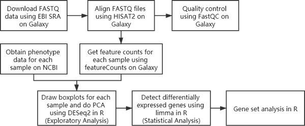

# 1 Introduction

This report displays the workflow for RNA-seq analysis to evaluate differential gene expression between fetus and adult brains. The detailed background can be found from this paper: http://www.ncbi.nlm.nih.gov/pmc/articles/PMC4281298. There are totally 12 samples (6 fetal vs. 6 adult) available. However, due to the resource limitation, I only chose half of them (3 fetal vs. 3 adult) to analyze. I selected 3 samples for fetal group: R3452, R3462, and R3485; and 3 samples for adult group: R2869, R3098, R3467. In addition, there are 2 runs (SRR15545xx and SRR20713xx) for each sample. Only SRR15545xx runs were used. Below is the workflow used.



Although I really want to display all the code for each step, I have to satisfy the five page limitation. So the codes to organize downloaded data in alignment, quality control, and feature counts will be hidden in R Markdown.

# 2 Alignment

First of all, I downloaded FASTQ data using EBI SRA on Galaxy. Files are in fastq.gz format and the library layout is paired. Each sample has two files (e.g.: SRR1554537 contains SRR1554537_1 and SRR1554537_2). Then I used HISAT2 on Galaxy to align reads to BAM format. The reference genome was set as `hg19` and the library layout was chosen as `Paired-end`. Other parameters were default. Below is the alignment result.

```{r, echo=FALSE}

run <- c("SRR1554537", "SRR1554538", "SRR1554541", "SRR1554535", "SRR1554536",
         "SRR1554539")
sample <- c("R3452", "R3462", "R3485", "R2869", "R3098", "R3467")
age <- c(-0.3836, -0.4027, -0.3836, 41.58, 44.17, 36.5)
sex <- c("female", "female", "male", "male", "female", "female")
RIN <- c(9.6, 6.4, 5.7, 8.7, 5.3, 9)
group <- c("fetal", "fetal", "fetal", "adult", "adult", "adult")
total_reads <- c(55133946, 68026190, 69278357, 38063721, 21450348, 33742728)
un_reads <- c(474170, 549305, 561488, 533477, 141926, 503288)
aligned_reads <- total_reads - un_reads
perc_align <- round(aligned_reads / total_reads, 4)*100
aligned_reads <- paste0(aligned_reads, " (", perc_align, "%)")


dat <- data.frame(run, sample, age, sex, RIN, group, total_reads, aligned_reads)
write.table(dat, "phenotype.txt", quote=FALSE, sep="\t", row.names=FALSE)
knitr::kable(dat)

```

# 3 Quality Control

I used FastQC on Galaxy to do quality control. All the parameters were default. In this way, I got two kinds of results for each sample: a webpage report with summary graphs and a text file with statistical results. Due to page limitation, I directly summarize information from the text file using R (without showing any graphs).

I am not sure what kind of number from report represents *"average quality score of mapped reads"*, so I calculated two numbers:

1. **mean_perbase**: I extracted the `Mean` column from `Per base sequence quality` table, and calculated the avarage of this column.

2. **mean_perseq**: This one is computed from `Per sequence quality scores` table. The rule is: Calculated the sum of `Quality` $\times$ `Count`, and then divided by the sum of `Count`.

```{r, echo=FALSE}

dat11 <- read.table("Galaxy20-[FastQC_on_data_13__RawData].txt", skip=12, nrows=55)
dat12 <- read.table("Galaxy20-[FastQC_on_data_13__RawData].txt", skip=71, nrows=39)
dat21 <- read.table("Galaxy22-[FastQC_on_data_14__RawData].txt", skip=12, nrows=55)
dat22 <- read.table("Galaxy22-[FastQC_on_data_14__RawData].txt", skip=71, nrows=39)
dat31 <- read.table("Galaxy24-[FastQC_on_data_15__RawData].txt", skip=12, nrows=55)
dat32 <- read.table("Galaxy24-[FastQC_on_data_15__RawData].txt", skip=71, nrows=39)
dat41 <- read.table("Galaxy26-[FastQC_on_data_16__RawData].txt", skip=12, nrows=55)
dat42 <- read.table("Galaxy26-[FastQC_on_data_16__RawData].txt", skip=71, nrows=39)
dat51 <- read.table("Galaxy28-[FastQC_on_data_17__RawData].txt", skip=12, nrows=55)
dat52 <- read.table("Galaxy28-[FastQC_on_data_17__RawData].txt", skip=71, nrows=39)
dat61 <- read.table("Galaxy30-[FastQC_on_data_18__RawData].txt", skip=12, nrows=55)
dat62 <- read.table("Galaxy30-[FastQC_on_data_18__RawData].txt", skip=71, nrows=39)

mean_perbase <- c(mean(dat11$V2), mean(dat21$V2), mean(dat31$V2), mean(dat41$V2),
                  mean(dat51$V2), mean(dat61$V2))
mean_perseq <- c(sum(dat12$V1 * dat12$V2)/sum(dat12$V2), 
                 sum(dat22$V1 * dat22$V2)/sum(dat22$V2), 
                 sum(dat32$V1 * dat32$V2)/sum(dat32$V2), 
                 sum(dat42$V1 * dat42$V2)/sum(dat42$V2), 
                 sum(dat52$V1 * dat52$V2)/sum(dat52$V2), 
                 sum(dat62$V1 * dat62$V2)/sum(dat62$V2))

```

```{r, echo=FALSE}

dat <- data.frame(run, sample, age, sex, RIN, group, perc_align, mean_perbase, mean_perseq)
knitr::kable(dat)

```

I used two-sided t-test to compare the mapping rates and the average quality score of mapped reads between fetal group and adult group. 

**Mapping Rates:**

```{r}

t.test(dat$perc_align[dat$group == "fetal"], dat$perc_align[dat$group == "adult"])$p.value

```
According to the p-value calculated, we can know that alignment rates for fetal group and adult group are similar under the 0.05 significance level (the p-value is larger than 0.05).

**Average Quality Score of Mapped Reads:**

```{r}

t.test(dat$mean_perbase[dat$group == "fetal"], dat$mean_perbase[dat$group == "adult"])$p.value
t.test(dat$mean_perseq[dat$group == "fetal"], dat$mean_perseq[dat$group == "adult"])$p.value

```

The results show that neither **mean_perbase** nor **mean_perseq** has difference between two groups under the 0.05 significance level (their p-values are all larger than 0.05).

# 4 Get Feature Count

I used featureCounts on Galaxy to get gene expression from BAM file for each sample. The gene annotation genome was hg19. I found the hg19 GTF file from Galaxy -> Shared Data -> Data Libraries -> iGenomes, and then imported it into History. In this way, we can get a `.tabular` file for one sample (so there are totally 6 files). Then I used R to combine them together.

```{r, echo=FALSE}

dir <- list.files(getwd(), pattern=".tabular")
datlist <- vector(mode="list", length=length(dir))
sample <- c("R3452", "R3462", "R3485", "R2869", "R3098", "R3467")
for (i in 1:length(dir)) {
    datlist[[i]] <- read.table(dir[i], skip=1)
    colnames(datlist[[i]]) <- c("GENEID", sample[i])
}
library(plyr)
rawcount <- join_all(datlist, by="GENEID", type="full", match="all")
rownames(rawcount) <- rawcount$GENEID
rawcount <- rawcount[, -1]
write.table(rawcount, "featurecounts.txt", quote=FALSE, sep="\t", row.names=TRUE)

```

# 5 Exploratory Analysis

I used DESeq2 to do the exploratory analysis. When drawing boxplots for each sample, log2 + 1 transformation was used because there are some zeros in raw expression matrix.

```{r, message=FALSE, warning=FALSE, fig.height=2, fig.width=4.5}

library(DESeq2); library(ggplot2); library(tidyverse)

rawcount <- read.table("featurecounts.txt", header=TRUE, sep="\t")
phenotype <- read.table("phenotype.txt", header=TRUE, sep="\t")
dds <- DESeqDataSetFromMatrix(countData=rawcount, colData=phenotype, design=~group)
log2count <- as.data.frame(log2(counts(dds) + 1))

datforplot <- log2count %>% gather(sample, value, colnames(log2count)[1]:colnames(log2count)[6])
datforplot <- left_join(datforplot, phenotype[, c("sample", "group")], by="sample")
ggplot(data=datforplot) + aes(x=sample, y=value, fill=group) + 
  geom_boxplot() + theme_bw() + labs(x="Samples", y="log2(count + 1)")

```

As we can see, the expression levels of fedal group may be a little larger than adult group.

The scatter plot of PCA is displayed below. In this plot, samples of fetal group gather on the left while adult group on the right, which means the value of PC1 in fetal group is lower than in adult group. In addition, male may have lower value of PC2 than female.

```{r, message=FALSE, warning=FALSE, fig.height=2, fig.width=4.5}

plotPCA(rlog(dds, blind=FALSE), intgroup=c("group", "sample", "sex", "RIN"))

```

# 6 Statistical Analysis

I used limma to do the statistical analysis. Genes with adjusted p-value smaller than 0.05 would be viewed as the differential expressed genes.

```{r, message=FALSE, warning=FALSE, fig.height=2, fig.width=4}

library(limma)
rawcount <- subset(rawcount, rowSums(rawcount) > 0) # remove genes with zeros in all samples
normcount <- log2(as.matrix(rawcount) + 1) # make log2 + 1 transformation

fit <- lmFit(normcount, model.matrix(~ phenotype$group))
fit <- eBayes(fit)
toptable <- topTable(fit, number=nrow(normcount))
deresult <- toptable[, c(1, 4, 5)]
deresult$gene <- rownames(deresult)
deresult <- deresult[, c(4, 1:3)]

par(mar = c(2,2,2,1))
with(deresult, plot(logFC, -log10(adj.P.Val), pch=20, main="Volcano plot"))
with(subset(deresult, adj.P.Val < 0.05), points(logFC, -log10(adj.P.Val), pch=20, col="red"))

```

The red points in volcano plot represent those differential expressed genes.

```{r}

sum(deresult$adj.P.Val < 0.05)

```

As we can see, there are totally 7094 differential expressed genes detected.

# 7 Gene Set Analysis

The fetal brain, adult brain and adult liver datasets from roadmap epigenomics project with narrow peaks are downloaded using AnnotationHub. TxDb.Hsapiens.UCSC.hg19.knownGene is the hg19 annotation database will be used.

```{r, message=FALSE, warning=FALSE}

library(TxDb.Hsapiens.UCSC.hg19.knownGene); library(AnnotationHub); library(mygene)
degene <- subset(deresult, adj.P.Val < 0.05)
ah <- AnnotationHub()
ah <- subset(ah, species == "Homo sapiens")
fetal <- AnnotationHub::query(ah, c("EpigenomeRoadMap", "H3K4me3", "E081"))[[2]]
adult <- AnnotationHub::query(ah, c("EpigenomeRoadMap", "H3K4me3", "E073"))[[2]]
liver <- AnnotationHub::query(ah, c("EpigenomeRoadMap", "H3K4me3", "E066"))[[2]]
txdb <- TxDb.Hsapiens.UCSC.hg19.knownGene
txdb_gene <- genes(txdb)

```

Gene symbols were used to identify genes in previous tasks, while hg19 database uses gene entrez id. So I used `mygene::queryMany()` to transfer gene symbol into entrez id.

```{r, message=FALSE, warning=FALSE}

degene_entrez <- queryMany(degene$gene, scopes="symbol", fields="entrezgene", species="human")$entrezgene
promoter <- promoters(txdb_gene[degene_entrez %in% txdb_gene$gene_id])
(fetal_perc <- length(subsetByOverlaps(fetal, promoter)) / length(fetal) * 100)
(adult_perc <- length(subsetByOverlaps(adult, promoter)) / length(adult) * 100)
(liver_perc <- length(subsetByOverlaps(liver, promoter)) / length(liver) * 100)

```

1. Are there changes in H3K4me3 between fetal and adult brain over promoters for genes differentially expressed between fetal and adult brain?

Yes. We can find there are `r round(fetal_perc, 2)`% of DE genes in fetal brain while `r round(adult_perc, 2)`% of DE genes in adult brain, which means there are some genes expressed in fetal brain but not in adult brain.

2. Are promoters of genes differentially expressed between adult and fetal brain marked by H3K4me3 in liver?

Yes. There are `r round(liver_perc, 2)`% of DE genes in liver, which is different from adult and fetal brain.